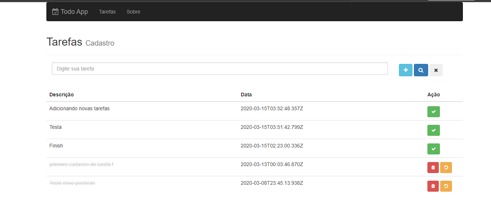

<h1 align="center" > TODO - APP </h1>

<h3>Tecnologias utilizadas neste projeto:</h3>
<ul>
<li>JavaScript</li>
<li>NodeJS</li>
<li>Express</li>
<li>React</li>
<li>MongoDB</li>
<li>JSX</li>
<li>CSS</li>
</ul>

<h2>A idéia do projeto</h2>

O <strong>TODO-APP</strong> é uma aplicação  web pensado para cadastramento e edição de tarefas.

<h3>Scripts úteis</h3>

Para iniciar o servidor: <code>npm run dev</code>

Iniciar a aplicação REACT: <code>yarn run dev</code> ou <code>npm run dev</code>

<h1>Segue abaixo algumas imagens do projeto web:</h1>

| | 
|:-------------------------:|
| | 

